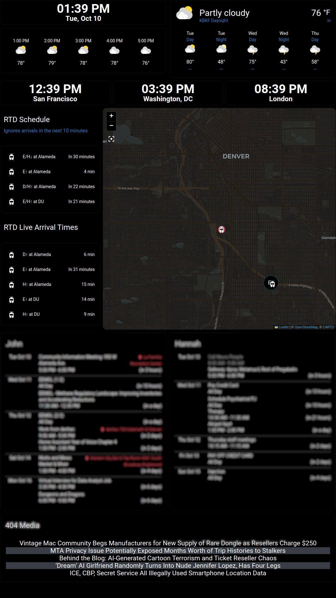

# kitchen-display
My personal home assistant kiosk display

# Home Assistant dependencies
## Custom Stuff
- [HACS](https://hacs.xyz/)
## HACS Frontend
- [List Card](https://github.com/iantrich/list-card)
- [Kiosk Mode](https://github.com/NemesisRE/kiosk-mode)
- [card-mod 3](https://github.com/thomasloven/lovelace-card-mod)
- [Amoled Theme](https://github.com/home-assistant-community-themes/amoled)
- [Atomic Calendar Revive](https://github.com/totaldebug/atomic-calendar-revive)
- [Digital Clock](https://github.com/wassy92x/lovelace-digital-clock)
## HACS Integrations
- [Feedparser](https://github.com/custom-components/feedparser)
- [GTFS Realtime](https://github.com/mark1foley/ha-gtfs-rt-v2)
## Home Assistant Addons
- Studio Code Server
- Advanced SSH & Web Terminal
## Home Assistant Integrations
- The calendar integration for your calendars such as Google Calendar or CalDAV (I use both)
- The weather service integration you want to use (I use National Weather Service)
- GTFS
# Configuration
Configuration for the GTFS, GTFS Realtime, and CalDAV entities are in `configuration.yaml`. Add these to your global `configuration.yaml` on your Home Assistant instance. using the Studio Code Server is the easiest way to do this. If you use NextCloud, you can insert your NextCloud URL and username where shown in the config. You will need to  add the password to your `secrets.yaml` file. I live by Alameda Station in Denver and I frequently go to DU, so I need the stop information for those areas, but feel free to use those as examples to modify how you would like.

Stop and route ids for GTFS can be found by exploring [here](https://transitfeeds.com/p/rtd-denver/188)

I also added zones for Alameda Station and DU so they show up on the map. Zones can be added in Home Assistant in `Settings -> Areas & Zones`.

To make the dashboard, I added a new dashboard in `Settings -> Dashboards` called `Kitchen Display`.  The dashboard only has one view, and the configuration for that view can be found in `kitchen-display.yaml`. You'll need to add your own calendar entities.

# Display
The display consists of a vertical 1920x1080 IPS monitor (IPS is important for readability at bad viewing angles) and a raspberry pi. The raspberry pi doesn't need to be anything special because it will just be serving a web page. The setup for the pi consists of a few steps:
1. install raspberry pi OS
2. log in to home assistant on raspberry pi web browser and set it to remember you
3. change the display orientation in the display settings
4. add shell script to launch dashboard
5. add systemd service to automatically start the script
## Install raspberry pi OS
https://www.raspberrypi.com/software/
## Log in to home assistant
Don't forget to do this!
## Change display orientation
https://pimylifeup.com/raspberry-pi-screen-resolution/
## Add shell script
The shell script is `home-assistant-kiosk.sh`. You can put it wherever feels best to you, but I just put it in the home directory of the `pi` user, `/home/pi/home-assistant-kiosk.sh`. You'll need to add your home assistant IP address in the script.
## Add systemd service
The service is `home-assistant-kiosk.service`. You'll put this file in `/etc/systemd/system/` and run the following commands in the terminal on your raspberry pi or over SSH:
```
sudo systemctl daemon-reload
sudo systemctl start home-assistant-kiosk
sudo systemctl enable home-assistant-kiosk
```
# Final thoughts
And you're done!

The main annoyance I have with this project is that I haven't been able to have the dashboard automatically update when I make changes to the configuration. Currently, whenever I make changes, I SSH into my raspberry pi and run
```
sudo systemctl restart home-assistant-kiosk
```
It's not perfect, and I would prefer an automated solution. There are some ideas in [this thread](https://community.home-assistant.io/t/solved-how-can-i-get-my-dashboard-to-refresh-automatically-instead-of-showing-the-refresh-prompt/357842/22), but I haven't implemented any yet.
